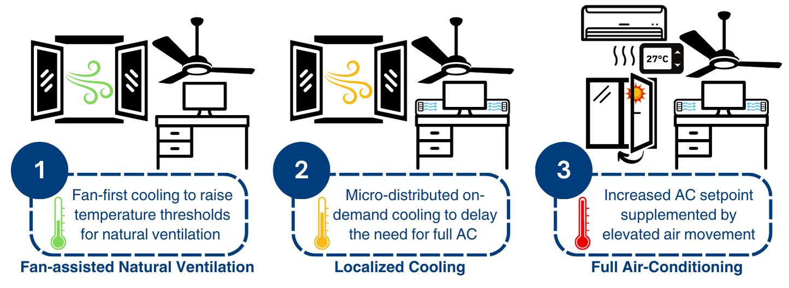

# 2024-bca-mmv
This repository contains the research compendium for our latest work, "Sustainable Cooling in the Tropics with Mixed-Mode Ventilation and Thermal Adaptation." This study proposes a novel mixed-mode ventilation (MMV) approach that prioritizes natural ventilation with ceiling fans, supplements with localized cooling as needed, and switches to full air-conditioning only when necessary. Through a 20-week longitudinal field study, we demonstrate that this incremental cooling approach which allows occupants to adapt to warmer indoor temperatures achieved 48% measured cooling energy savings, with annual energy savings projected to reach up to to 62%. The probability of an average participant finding a 30°C indoor temperature thermally acceptable increased from 43% in the first week of exposure to 92% by week 16, highlighting the potential for gradual thermal adaptation to sustain comfort over time. More importantly, our field data support the hypothesis that occupants accustomed to conventional AC environments (23–25°C) can adapt to the warmer and more dynamic indoor conditions of MMV.

The compendium includes all the data and code needed to reproduce the analysis as well supplimentary findings on indoor environmental quality in MMV. More details can be found in our paper:
> ⚠️ **Work in Progress:** The documentation is currently being updated. Some sections may be incomplete.

> Yue Lei, Sicheng Zhan and Adrian Chong, (2025).
> *Sustainable Cooling in the Tropics with Mixed-Mode Ventilation and Thermal Adaptation*.
> *Building and Environment*. <https://doi.org/xxx/xxx>

Please cite this compendium as:
```
@article{2025sustainable,
  title={Sustainable Cooling in the Tropics with Mixed-Mode Ventilation and Thermal Adaptation},
  author={Lei, Yue and Zhan, Sicheng and Chong, Adrian},
  year={2025},
  note={In Revision}
}
```


## Repository Structure

```
./
├── requirement.txt                             # List of Python packages required to run the project
├── Code                                        # Scripts for data analysis and visualization
│   ├── comfort_data.ipynb                      # Jupyter Notebook for analyzing and visualizing subjective survey and environmental measurement data
│   └── energy_data.ipynb                       # Jupyter Notebook for analyzing measured energy data, including energy savings M&V using Gaussian Process regression
├── data                                        # Datasets collected from our 20-week longitudinal field study
│   ├── comfort                                 # Datasets for occupant comfort analysis
│   │   ├── backgroundContinousMonitoring.csv   # Continuous background environmental monitoring at the center of occupied spaces
│   │   ├── filteredCompleteData.csv            # Subjective survey responses with concurrent in-situ IEQ (Indoor Environmental Quality) measurements
│   │   └── genderAge.csv                       # Participants' demographic information (gender and age)
│   └── energy                                  # Datasets for energy performance analysis
│       ├── dailyEnergy.csv                     # Aggregated daily cooling energy and outdoor weather data for Gaussian Process modeling
│       ├── energyMeter.csv                     # Historical metered cooling power by end use and corresponding outdoor weather conditions
│       └── SingaporeAMY2023.epw                # Singapore Changi Airport 2023 Actual Meteorological Year (AMY) weather file in EPW format
└── paper                                       # Materials for manuscript preparation
    ├── figures                                 # Key figures used in the paper
    ├── tex                                     # LaTeX source files for manuscript writing (to be updated)
    └── bib                                     # Bibliographic database file (to be updated)

```

### Licenses

**Text and figures :**  [CC-BY-4.0](http://creativecommons.org/licenses/by/4.0/)

**Code :** See the [LICENSE](LICENSE) file

**Data :** [CC-0](http://creativecommons.org/publicdomain/zero/1.0/) attribution requested in reuse
