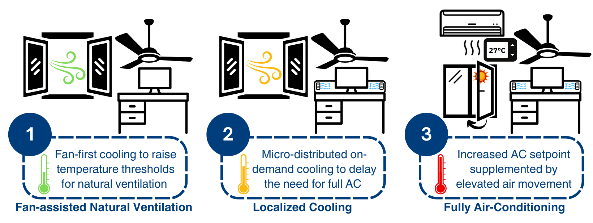

# 2024-bca-mmv
This repository contains the research compendium for our latest work, "Sustainable Cooling in the Tropics with Mixed-Mode Ventilation and Thermal Adaptation." This study proposes a novel mixed-mode ventilation (MMV) approach that prioritizes natural ventilation with ceiling fans, supplements with localized cooling as needed, and switches to full air-conditioning only when necessary. Through a 20-week longitudinal field study, we demonstrate that this incremental cooling approach which allows occupants to adapt to warmer indoor temperatures achieved 48% measured cooling energy savings, with annual energy savings projected to reach up to to 62%. The probability of an average participant finding a 30°C indoor temperature thermally acceptable increased from 43% in the first week of exposure to 92% by week 16, highlighting the potential for gradual thermal adaptation to sustain comfort over time. More importantly, our field data support the hypothesis that occupants accustomed to conventional AC environments (23–25°C) can adapt to the warmer and more dynamic indoor conditions of MMV.

The compendium includes all the data and code needed to reproduce the analysis as well supplimentary findings on indoor environmental quality in MMV. More details can be found in our paper:

> Yue Lei, Sicheng Zhan and Adrian Chong, (2025).
> *Sustainable Cooling in the Tropics with Mixed-Mode Ventilation and Thermal Adaptation*.
> *Building and Environment*. <https://doi.org/xxx/xxx>

Please cite this compendium as:
```
@article{2025sustainable,
  title={Sustainable Cooling in the Tropics with Mixed-Mode Ventilation and Thermal Adaptation},
  author={Lei, Yue and Zhan, Sicheng and Chong, Adrian},
  year={2025},
  note={In Revision}
}
```

> ⚠️ **Work in Progress:** The documentation is currently being updated. Some sections may be incomplete.

